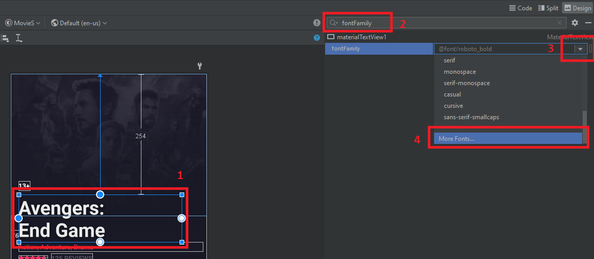
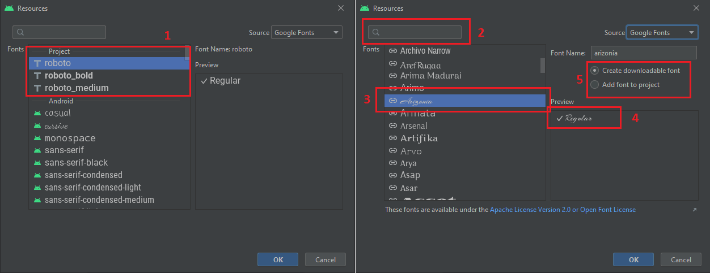
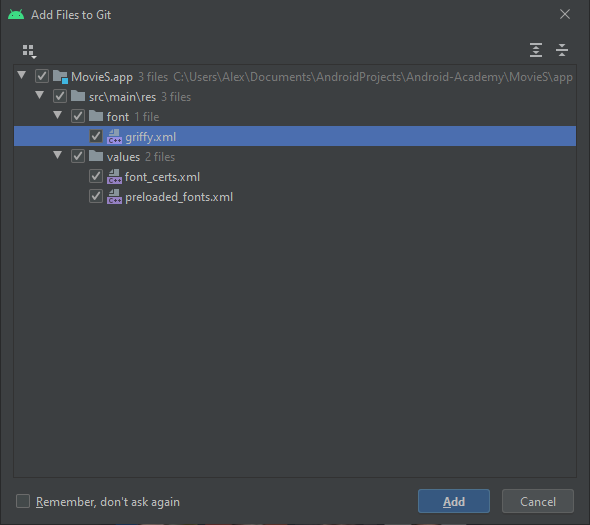
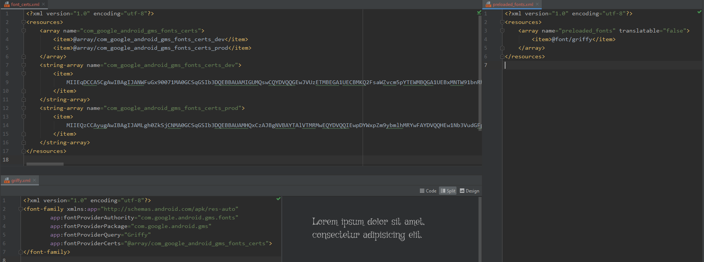
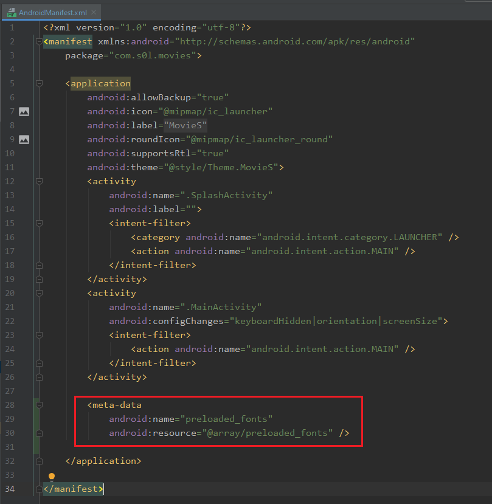

Как добавить любой (почти) шрифт в ресурсы приложения
============================================================================

Часто встречается ситиуция, когда необходимо добавить в ваше приложение нестандартный шрифт

В **Android Studio** достаточно давно имеется возможность добавить нужный вам шрифт в приложение.

# Шаг 1

1. Выбираем любой **TextView** в вашем приложении
2. В разделе **Attributes** ищем свойство **fontFamily**
3. Нажимаем справа на кнопку, что бы получить список доступных к использованию шрифтов, и...
4. Прокручиваем в самый низ, до надписи **More Fonts...** И нажимаем на неё

# Шаг 2
В появившемся окне видим:

1. Шрифты которые уже есть в вашем проекте (список может быть пустым)
2. В окне поиска можно написать имя интересующего нас шрифта
3. Выбираем нужный нам шрифт
4. Выбираем нужный стиль regular, **bold**, *italic* и т.д.
5. Выбираем как данный шрифт будет добавлен в ваш проект
    * **Add font to project** - этот вариант просто добавит выбранный шрифт в виде **TTF** ресурса в ваш проект (...res/font/roboto.ttf)
    * **Create downloadable font** - этот вариант добавит в ваш проект т.н. загружаемые при старте приложения шрифты файлы. **Android Studio** при этом автоматически генерит все нужные ддля корректной работы XML ресурсы 

# Шаг 3
Рассмотрим что сгенерила нам в последнем случае **Android Studio**
**...res/values/preloaded_fonts.xml** - в этом файле по сути делается объявление нашего нового шрифта, для его предварительной загрузки
**...res/values/font_certs.xml** - в этом файле находится сертификаты для поставщика выбранного шрифта
**...res/font/griffy.xml** - в этом файле находится описание нашего шрифта с корневым элементом **font-family**

Так же в файл **AndroidManifest.xml** добавляется **meta-data** о нашем загружаемом шрифте, это необходимо для корректной предзагрузки нашего шрифта, в противном случа система не узнает о том что нам нужен данный шрифт и приложение будет использовать стандартный системный шрифт.

    
Все, на этом работа по добавлению нового шрифта в проект завершена, вы можете его использовать стандартным способом **android:fontFamily="@font/griffy"**
    
Дополнительно почиать можно здесь [https://developer.android.com/guide/topics/ui/look-and-feel/downloadable-fonts](https://developer.android.com/guide/topics/ui/look-and-feel/downloadable-fonts)
